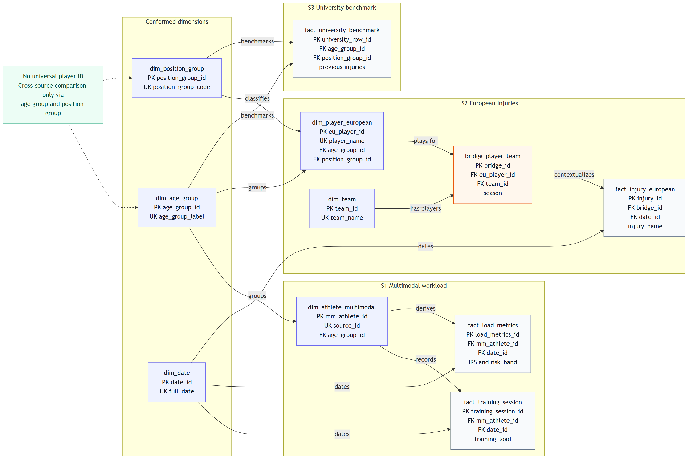

---
format:
  pdf:
    include-in-header:
      text: |
        \usepackage{pdflscape}
---

# Injury Risk Predictor Midterm Draft Report

This is the working midterm report for the DBM project. It captures where the database design stands now and how the current implementation supports the injury-risk use case.

## 1. Project Idea and Decision Problem

The Injury Risk Predictor is meant for a football coach or sports scientist who wants a quick view of workload-related injury risk. Before planning the next training block, the coach needs to know which athletes can keep their current load, which athletes can increase load, and which athletes should probably reduce load.

The database turns that question into a MySQL pipeline. Raw workload sessions, injury-event records, and benchmark player profiles are loaded into staging tables, transformed into dimensions and facts, and then used to calculate an Injury Risk Score (IRS). The dashboard can then rank athletes by risk band instead of leaving the coach to inspect raw workload rows manually.

## 2. Data Sources

The project uses three independent CSV-based datasets.

| Source | Dataset | Main content | Grain | Role in database |
|---|---|---|---|---|
| S1 | Multimodal Sports Injury Dataset | workload sessions, athlete attributes, injury flag | session x anonymous athlete | workload and IRS calculation |
| S2 | European Football Injuries 2020-2025 | player names, clubs, seasons, injury events | injury event | player/team/injury event layer |
| S3 | University Football Injury Prediction Dataset | static profile features and injury-next-season label | anonymous player profile | benchmark layer |

The source data does not provide a universal player identifier. The Multimodal dataset has anonymous `athlete_id` values and no calendar dates, the University dataset contains anonymous profile rows, and only the European dataset includes named football players and clubs. Because of this, the project avoids a forced player-level merge across all three datasets.

## 3. Integration Strategy

The core integration decision is a hybrid schema rather than one canonical `dim_player`.

- S1 is modeled as an anonymous athlete/session universe.
- S2 is modeled as a named European football player/team/injury universe.
- S3 is modeled as an anonymous benchmark universe.
- Cross-source comparison is only made through conformed dimensions such as age group and position group.

A direct row-level join across all three datasets would create false precision. There is no evidence that an athlete in S1 and a player in S3 or S2 are the same real-world person. The database therefore supports source-specific analysis and aggregate benchmarking, not a longitudinal master record for every player.

## 4. Conceptual Model

The model has three subject areas:

1. Workload and IRS:
   `dim_athlete_multimodal`, `fact_training_session`, `fact_load_metrics`, `dim_date`, `dim_age_group`

2. European injury events:
   `dim_player_european`, `dim_team`, `bridge_player_team`, `fact_injury_european`, `dim_position_group`, `dim_age_group`, `dim_date`

3. Benchmark profiles:
   `fact_university_benchmark`, `dim_position_group`, `dim_age_group`

The M:N relationship required by the project is represented by `bridge_player_team`: one player may be associated with multiple teams across seasons, and a team has many players. Injury events reference this bridge so that each injury is interpreted in its player/team/season context.

## 5. ERD

The ERD separates the three source-specific areas and shows the conformed dimensions used for aggregate comparison. The labels on the relationships describe the role of each connection.

```{=latex}
\clearpage
\begin{landscape}
```

{#fig-erd width=100%}

```{=latex}
\end{landscape}
\clearpage
```

| Entity | Type | Primary key | Main role |
|---|---|---|---|
| `dim_age_group` | dimension | `age_group_id` | conformed age bands across sources |
| `dim_position_group` | dimension | `position_group_id` | conformed GK/DEF/MID/FWD groups |
| `dim_date` | dimension | `date_id` | real European injury dates and synthetic session dates |
| `dim_athlete_multimodal` | dimension | `mm_athlete_id` | anonymous athletes from S1 |
| `fact_training_session` | fact | `training_session_id` | one workload session per anonymous athlete |
| `fact_load_metrics` | fact | `load_metrics_id` | derived acute/chronic load and IRS |
| `dim_team` | dimension | `team_id` | European football clubs |
| `dim_player_european` | dimension | `eu_player_id` | named players from S2 |
| `bridge_player_team` | bridge | `bridge_id` | M:N player/team/season relationship |
| `fact_injury_european` | fact | `injury_id` | European injury events |
| `fact_university_benchmark` | fact | `university_row_id` | anonymous S3 benchmark profiles |

Main relationships:

- `dim_age_group` links to multimodal athletes, European players, and University benchmark rows.
- `dim_position_group` links to European players and University benchmark rows.
- `dim_date` links to training sessions, load metrics, and European injury events.
- `dim_athlete_multimodal` links to training sessions and derived load metrics.
- `dim_player_european` and `dim_team` are connected through `bridge_player_team`.
- `fact_injury_european` references `bridge_player_team`, so injuries keep player, team, and season context.

## 6. Physical Schema and Normalization

The physical schema uses surrogate integer primary keys in all dimensions and facts. Source identifiers such as `athlete_id` are retained as source attributes, but not used as database-wide business keys. This keeps the load process less dependent on inconsistent source formats.

The schema follows a dimensional/star-style analytical design while keeping lookup attributes normalized:

- `dim_age_group` stores reusable age bands.
- `dim_position_group` stores the conformed GK/DEF/MID/FWD groups.
- `dim_team` stores club information once.
- `bridge_player_team` resolves the player/team/season M:N relationship.
- Facts store measures and foreign keys, not repeated descriptive attributes.

This keeps repeated labels out of the fact tables while still leaving the dashboard queries fairly direct.

## 7. Loading and Transformation Pipeline

The ELT order is:

1. Create the MySQL database.
2. Create tables, primary keys, foreign keys, and lookup constraints.
3. Load the three raw CSV files into all-text staging tables.
4. Populate dimensions and facts from staging.
5. Derive rolling workload metrics and IRS bands.
6. Use the derived tables and views for analytical queries and dashboard cards.

The load step keeps staging columns as `TEXT`. Casting and data cleaning happen in the transformation step, where the logic is visible in SQL. Examples include trimming strings, converting date strings through `STR_TO_DATE`, removing `"nan"` values, and deriving synthetic dates for the Multimodal sessions.

## 8. Key Transformations

### Synthetic Dates for Multimodal Sessions

The Multimodal dataset has session order but no real calendar date. The pipeline therefore derives synthetic dates from `session_id` order within each athlete:

```sql
DATE_ADD('2024-01-01', INTERVAL (
    ROW_NUMBER() OVER (
        PARTITION BY athlete_id
        ORDER BY CAST(NULLIF(TRIM(session_id), '') AS UNSIGNED)
    ) - 1
) DAY) AS synthetic_date
```

This makes it possible to join to `dim_date` and use rolling-window SQL. In the interpretation, these dates must be treated as session-order dates rather than real calendar dates.

### Injury Context Through Bridge Table

European injury events are linked through `bridge_player_team`, not directly to `dim_player_european`. This preserves the season and club context of each injury event:

```sql
JOIN bridge_player_team b
  ON b.eu_player_id = p.eu_player_id
 AND b.team_id      = t.team_id
 AND b.season       = TRIM(e.season)
```

### Rolling IRS Calculation

The IRS is calculated from rolling acute and chronic workload windows:

```sql
AVG(ts.training_load) OVER (
    PARTITION BY ts.mm_athlete_id
    ORDER BY d.full_date
    ROWS BETWEEN 6 PRECEDING AND CURRENT ROW
) AS acute_load_7
```

The chronic window uses 28 sessions. IRS remains `NULL` until the chronic window contains a full history.

## 9. Implemented Decision Rule

The implemented SQL bands are:

| Band | Range | Interpretation |
|---|---:|---|
| High Risk | `IRS >= 2.0` | immediate load reduction |
| Caution | `1.2 <= IRS < 2.0` | monitor closely |
| Optimal | `0.8 <= IRS < 1.2` | maintain training plan |
| Underloaded | `IRS < 0.8` | progressively increase load |
| Not enough history | fewer than 28 sessions | wait for chronic window |

The base IRS follows the acute:chronic workload ratio idea. The project also computes an adjusted IRS by multiplying raw IRS with benchmark factors from the University and European injury data. Because that adjusted score can be higher than the raw IRS, the implemented high-risk threshold is set at `2.0`.

## 10. Current Data and Quality Status

The latest verified database load produced the following row counts:

| Table | Rows |
|---|---:|
| `stg_european_injuries` | 15,603 |
| `stg_multimodal_sessions` | 15,420 |
| `stg_university_benchmark` | 800 |
| `dim_age_group` | 6 |
| `dim_position_group` | 4 |
| `dim_team` | 145 |
| `dim_date` | 1,729 |
| `dim_player_european` | 4,080 |
| `bridge_player_team` | 8,645 |
| `dim_athlete_multimodal` | 156 |
| `fact_university_benchmark` | 800 |
| `fact_injury_european` | 15,603 |
| `fact_training_session` | 15,420 |
| `fact_load_metrics` | 15,420 |

Checks performed so far:

- European injury dates parse successfully.
- Fact tables link through foreign keys.
- No player-level cross-source merge is forced.
- Rolling IRS stays unavailable until sufficient history exists.

## 11. Analytics and Dashboard Direction

The analytics layer is designed around a small number of coach-facing questions rather than many disconnected SQL outputs. The most important question is which athletes currently sit outside the desired workload range. The second question is how those risk bands are distributed across the anonymous athlete population and whether benchmark factors change the interpretation.

At this stage, the dashboard direction is:

| Area | Purpose |
|---|---|
| Risk overview | show the distribution of athletes across risk bands |
| Athlete ranking | highlight athletes with the highest raw or adjusted IRS |
| Workload trend | show how acute and chronic load develop over time |
| Injury context | summarize European injury events by team, position, and injury type |
| Benchmark context | compare age and position groups using the University profile data |

The dashboard should stay close to the decision rule. Its purpose is not to prove medical causality, but to make the database output understandable enough for a coach to decide where to inspect workload more closely.

## 12. Efficiency Considerations

The main efficiency idea at this stage is to separate raw data loading, relational modeling, and derived analytical metrics. Raw CSV rows are first stored in staging tables. Cleaned dimensions and facts are then built from those staging tables. Finally, workload indicators such as IRS are stored in a derived fact table instead of being recalculated from scratch for every dashboard query.

This design should make the dashboard easier to use because the most important workload values are already prepared in the database. The schema also keeps descriptive attributes in dimensions and numerical observations in fact tables, which keeps joins understandable and avoids repeating labels across many rows.

At midterm level, the relevant point is the design choice: costly derived values are separated from raw input rows, so the dashboard can work with prepared analytical tables instead of raw CSV-shaped data.

## 13. Known Limitations

- The Multimodal source uses synthetic dates because real calendar dates are not available.
- Cross-source claims must stay at benchmark level; there is no true shared player ID.
- The European and University datasets likely represent different populations.
- The adjusted IRS is a project heuristic rather than a clinically validated model.
