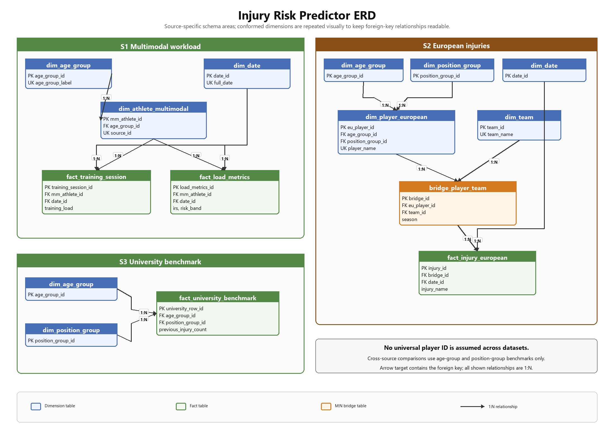
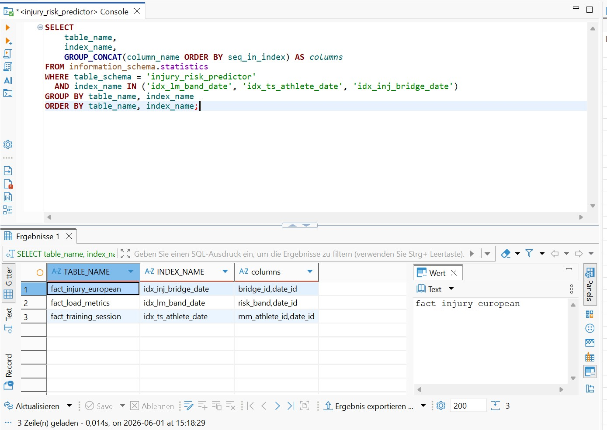
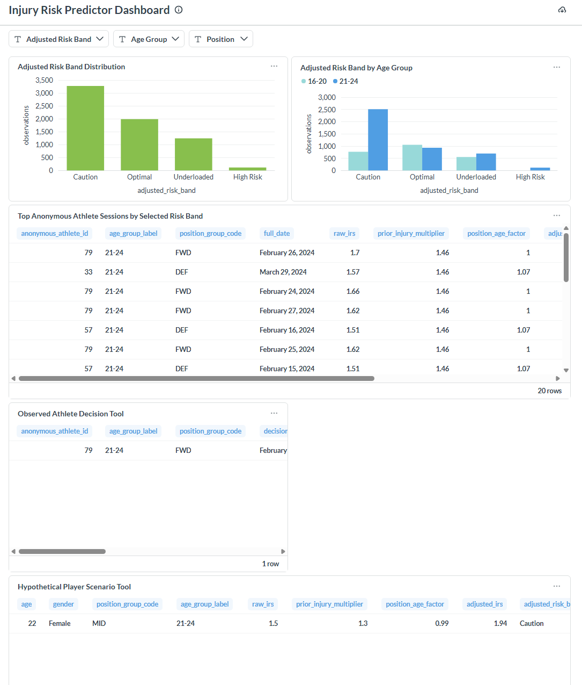

\begin{titlepage}
\thispagestyle{empty}
\centering

\vspace*{3cm}

{\Huge Injury Risk Predictor Dashboard \par}
\vspace{0.8cm}
{\Large HSLU -- Module DBM Project Report \par}

\vspace{3cm}

Andrin Lehmann (andrin.lehmann@stud.hslu.ch)\\
\vspace{0.2cm}
Maurice Salzmann (maurice.salzmann@stud.hslu.ch) \\
\vspace{0.2cm}
Alina Caspar (alina.caspar@stud.hslu.ch) \\
\vspace{0.2cm}
Aurora Rigo (aurora.rigo@stud.hslu.ch)

\vfill
\today
\end{titlepage}

\clearpage
\setcounter{tocdepth}{2}
\thispagestyle{empty}
\tableofcontents

\clearpage
\pagenumbering{arabic}
\setcounter{page}{1}

# Introduction & Context {#sec-Introduction}

Soft-tissue injuries in professional football cost clubs an estimated €500M per season in lost wages and medical costs, with hamstring strains alone accounting for more than 15% of all time-loss injuries. A growing body of sports-science literature (Gabbett, 2016; Hulin et al., 2016) shows that a disproportionate spike in acute training load relative to chronically accumulated fitness is a leading predictor of non-contact injuries. Yet most clubs still rely on subjective session-RPE or on proprietary black-box wearable dashboards that coaches cannot interrogate.

The primary objective of this project is to demonstrate core database management concepts. Using a football injury prevention context as an illustrative setting, we design a relational data model, implement it in MySQL, and integrate three independent data sources using an ELT approach. SQL is then used to derive the Acute-to-Chronic Workload Ratio (ACWR) - our injury risk key figure - and apply a published decision rule in an interactive Metabase dashboard.

Following the OECD Data Value Cycle from the lecture, raw data is transformed into structured information and decision-relevant metrics. Workload telemetry, injury event records, and player features are combined and aggregated at the player-day level, and finally visualized with an interactive Metabase dashboard. This enables parameterized analysis and the application of a mathematically defined decision rule to support transparent, evidence-based load management decisions for a football coach.

# Project Idea & Use Case {#sec-ProjectIdea}

Our *Injury Risk Predictor Dashboard* project aims to support data-driven load management decisions by combining workload telemetry, injury event history, and static player features. A football coach or sports scientist faces the challenge of *deciding which players to rest or whose training load to reduce* during the weekly microcycle. Our database and dashboard create value by enabling coaches to identify players whose current workload profile places them at elevated injury risk, based on quantitative and objective metrics. For this purpose we integrate three complementary data perspectives:

1.  **Workload telemetry**: daily session load, training intensity, duration, fatigue index
2.  **Injury event history**: recorded injuries with type, severity, absence duration
3.  **Player features**: static attributes - age, position, sport type, prior injury history

## Data Sources

To keep the project focused on the core learning objectives of this module we deliberately rely on publicly available datasets from Kaggle and sports-science research repositories. These datasets are well-structured and widely cited in the injury-prediction literature. For the purpose of this project as a proof of concept they are suitable, but for any production-level application, live data from a club's wearable provider (Catapult, STATSports) would need to be integrated.

**Multimodal Sports Injury Dataset (S1)**

-   Source: Kaggle, <https://www.kaggle.com/datasets/anjalibhegam/multimodal-sports-injury-dataset>
-   Type: `.csv`, 15,420 rows
-   Content: One row per training session per anonymous athlete. Fields include `athlete_id`, `session_id`, `training_load`, `training_intensity`, `training_duration`, `fatigue_index`, `injury_occurred`, plus biometric and environmental sensors (heart rate, BMI, humidity, etc.)
-   Purpose: Provides the time-series workload signal to compute rolling acute and chronic loads

**European Football Injuries Dataset (S2)**

-   Source: Kaggle, <https://www.kaggle.com/datasets/sananmuzaffarov/european-football-injuries-2020-2025/data>
-   Type: `.csv`, 15,603 rows
-   Content: Injury records from major European leagues across five seasons (2020/21 - 2024/25). Fields include `player_name`, `club`, `league`, `season`, `player_position`, `player_age`, `injury`, `days`, `games_missed`, `injury_from_parsed`
-   Purpose: Named players with real injury dates and club affiliations, enabling M:N player-team modelling and league-level injury rate benchmarks

**University Football Injury Prediction Dataset (S3)**

-   Source: Kaggle, <https://www.kaggle.com/datasets/yuanchunhong/university-football-injury-prediction-dataset/data>
-   Type: `.csv`, 800 rows
-   Content: Anonymous player profiles with static biomechanical attributes - `age`, `height_cm`, `weight_kg`, `position`, `training_hours_per_week`, `previous_injury_count`, `injury_next_season` (binary label), and several fitness test scores
-   Purpose: Benchmark reference for prior injury count multiplier in the adjusted IRS

The three datasets are linked via a composite strategy: the multimodal dataset supplies the workload time-series per athlete, the European dataset provides named player and injury event data, and the university dataset contributes a static benchmark multiplier. All three are connected at aggregate level through the conformed dimensions `dim_age_group` and `dim_position_group`. See @sec-DatabaseModel for the integration logic.

## Key Figures

### Acute:Chronic Workload Ratio (ACWR / IRS)

The core key figure is the **Acute-to-Chronic Workload Ratio**, which we label *Injury Risk Score (IRS)*. For each athlete $i$ on each session-day $t$, let $L_{i,t}$ denote the daily training load. The acute load is the rolling 7-session average; the chronic load is the rolling 28-session average:

$$
\text{AcuteLoad}_{i,t} = \frac{1}{7} \sum_{s=t-6}^{t} L_{i,s}
$$ {#eq-acute-load}

$$
\text{ChronicLoad}_{i,t} = \frac{1}{28} \sum_{s=t-27}^{t} L_{i,s}
$$ {#eq-chronic-load}

$$
\text{IRS}_{i,t} = \frac{\text{AcuteLoad}_{i,t}}{\text{ChronicLoad}_{i,t}}
$$ {#eq-irs}

An IRS substantially above 1 indicates the athlete is accumulating load faster than their long-term conditioning supports - the "sweet spot" violation associated with elevated injury risk in the literature. Because the multimodal dataset contains no real calendar dates, session order (derived from `session_id`) is used as the time axis; a synthetic date starting 2024-01-01 is assigned per athlete for `dim_date` compatibility.

### Adjusted IRS

To enrich the raw IRS with cross-source context, we compute an **Adjusted IRS** by multiplying two factors derived from the other two datasets:

$$
\text{AdjustedIRS}_{i,t} = \text{IRS}_{i,t} \times \text{prior\_injury\_multiplier} \times \text{position\_age\_factor}
$$

-   **prior\_injury\_multiplier** (S3): $1.0 + 0.3 \times \text{avg\_previous\_injury\_count}$ per age group - captures historical injury burden (Fuller et al., 2006)
-   **position\_age\_factor** (S2): ratio of age-position injury rate to overall average injury rate from the European dataset - captures benchmark-level positional and age-related risk exposure (Ekstrand et al., UEFA Injury Studies)

The base adjusted view joins factors at `age_group_id` level - the finest grain at which all three sources can be compared without a shared player identifier. The Metabase dashboard uses an additional view, `vw_adjusted_irs_with_position`, to support position filters and the hypothetical scenario tool. Because the multimodal workload dataset has no observed position field, anonymous athletes receive a stable demonstration position group for dashboard filtering; position-sensitive interpretations are therefore benchmark support, not observed athlete position facts.

## Decision Rule

Based on the Adjusted IRS, the coach applies the following four-band decision rule:

| Adjusted IRS | Risk Band | Action |
|---|---|---|
| ≥ 2.0 | High Risk | Reduce load immediately |
| 1.2 - 2.0 | Caution | Monitor closely, reduce slightly |
| 0.8 - 1.2 | Optimal | Maintain current load |
| < 0.8 | Underloaded | Consider increasing load |

Thresholds follow Gabbett (2016) for the base IRS; the upper band of the adjusted score is raised to 2.0 because the multipliers inflate values above the raw IRS range. In the live Metabase dashboard view, the adjusted IRS distribution across 6,619 scored athlete-days is: Caution 3,272 · Optimal 1,987 · Underloaded 1,242 · High Risk 118.

# Data Model & Database Schema {#sec-DatabaseModel}

## Source Data Analysis

### Multimodal Sports Injury Dataset (S1)

The dataset contains 15,420 rows across 156 distinct athletes, each with 29 columns. Key columns used in the project:

| Column | Type in source | Notes |
|---|---|---|
| `athlete_id` | integer | local athlete identifier; no names |
| `session_id` | integer | ordered within athlete; used as time proxy |
| `training_load` | float | primary workload metric for IRS |
| `training_intensity` | categorical | Low / Medium / High |
| `training_duration` | float | session length in minutes |
| `fatigue_index` | float | self-reported fatigue score |
| `injury_occurred` | binary (0/1) | whether injury was recorded in this session |
| `age`, `gender`, `sport_type`, `bmi` | mixed | athlete demographics |

The dataset has no real calendar dates. Session ordering within each athlete is used to assign synthetic dates starting 2024-01-01 (one day per session). Athletes range from age 16 to 34 (age groups 16-20: 33, 21-24: 59, 25-29: 52, 30-34: 12).

### European Football Injuries Dataset (S2)

The dataset contains 15,603 injury records from 145 clubs across five seasons (2020/21 - 2024/25). Key columns:

| Column | Type in source | Notes |
|---|---|---|
| `player_name` | string | used as natural key for `dim_player_european` |
| `club`, `league` | string | club identifier; with season forms M:N bridge key |
| `season` | string | e.g. `20/21` |
| `player_position` | string | granular position (e.g. Centre-Back, Left Winger) |
| `player_age` | integer | age at time of injury |
| `injury` | string | injury label (e.g. Hamstring injury, Muscle injury) |
| `days` | string | days absent (some values contain text, cleaned with REGEXP) |
| `games_missed` | integer | matches missed |
| `injury_from_parsed` | string | injury start date, M/D/YYYY format |

Top injury types: Hamstring injury (1,256), Corona virus (986), Muscle injury (960), muscular problems (940), Knee injury (584). Season distribution is balanced: 2020/21 - 1,750 bridge entries, up to 2024/25 - 1,802.

### University Football Injury Prediction Dataset (S3)

The dataset contains 800 anonymous player profiles with 19 columns. No player names, team names, or dates are available. Key columns used:

| Column | Type in source | Notes |
|---|---|---|
| `age` | integer | used to assign `age_group_id` |
| `position` | string | Goalkeeper / Defender / Midfielder / Forward |
| `previous_injury_count` | integer | drives the prior injury multiplier |
| `training_hours_per_week` | float | stored for benchmarking |
| `injury_next_season` | binary (0/1) | outcome label |
| `bmi` | float | stored for benchmarking |

Because no linking identifier exists to S1 or S2, this source is used exclusively as a benchmark aggregate: average `previous_injury_count` per age group is the sole input to the multiplier.

### Deriving the Conceptual Model from Source Data

Three integration constraints shaped the model:

1. S1 has no player names or real dates - it can only supply a workload time-series per anonymous athlete
2. S2 has named players with club affiliations that change across seasons - this is the only source that requires a M:N player-team bridge
3. S3 has no identifiers whatsoever - it feeds only as an aggregate benchmark

Because no universal player identifier exists across sources, the model uses **conformed dimensions** (`dim_age_group`, `dim_position_group`) as the sole cross-source join keys. All player-level analysis stays source-specific; cross-source comparisons are made at age-group and position-group granularity only.

## Conceptual Model

The schema separates into three source-specific subject areas connected by two shared conformed dimensions.

**Entities:**

- `dim_athlete_multimodal` - anonymous athlete from S1; local `source_id` maps back to the CSV `athlete_id`
- `dim_player_european` - named football player from S2; one row per distinct player name
- `dim_team` - football club from S2
- `bridge_player_team` - M:N bridge between player and team; one row per player × club × season combination. A player who transferred clubs appears in multiple rows
- `dim_age_group` - conformed dimension shared by all three sources (bands: 16-20, 21-24, 25-29, 30-34, 35-39, 40+)
- `dim_position_group` - conformed dimension shared by S2 and S3 (GK, DEF, MID, FWD)
- `dim_date` - calendar dimension populated with both synthetic S1 dates and real S2 injury dates
- `fact_training_session` - one row per S1 session; workload attributes per athlete per day
- `fact_load_metrics` - derived rolling ACWR table; one row per S1 session-day with IRS and risk band
- `fact_injury_european` - one row per S2 injury event; linked to bridge_player_team
- `fact_university_benchmark` - one row per S3 player profile; benchmark reference only

**Key relationships:**

- `dim_player_european` ↔ `dim_team` (M:N via `bridge_player_team`)
- `dim_athlete_multimodal` → `fact_training_session` (1:N)
- `dim_athlete_multimodal` → `fact_load_metrics` (1:N)
- `bridge_player_team` → `fact_injury_european` (1:N)
- All three player/athlete dims → `dim_age_group` (N:1)

{#fig-erd width=95%}

## Physical Database Schema in DDL

The full DDL is in `sql/01_schema/01_create_tables.sql`. Key design decisions:

### Primary Keys

All entities use surrogate `INT AUTO_INCREMENT` primary keys. This decouples the schema from source-data natural keys (player names, athlete IDs) that may contain encoding inconsistencies or change across seasons. The original source identifier is preserved as a separate `source_id` column in `dim_athlete_multimodal`.

### Foreign Keys

All foreign key constraints are enforced at the InnoDB engine level. `FOREIGN_KEY_CHECKS` is disabled during DDL creation and re-enabled after, which allows forward-references in the CREATE TABLE sequence without ordering constraints.

### Data Types

`DECIMAL` is used for all workload metrics (`training_load`, `acute_load_7`, `chronic_load_28`, `irs`) to avoid floating-point rounding in aggregates. `DATE` is used for `dim_date.full_date`. `VARCHAR` is sized to observed maxima with a small buffer; `TINYINT` is used for age fields.

### Index Strategy

Covered in depth in @sec-Efficiency. Composite indexes on `(mm_athlete_id, date_id)` are the primary optimization target since the rolling window functions partition on athlete and order by date.

### Third Normal Form Rationale

The schema is in 3NF: every non-key attribute depends on the whole primary key and on nothing but the primary key.

- League and country information belong to `dim_team`, not to `dim_player_european`, so no player row carries a transitive team attribute
- Age group label and band boundaries belong to `dim_age_group`, not duplicated in player or fact rows
- Position name belongs to `dim_position_group`; fact rows carry only the FK
- `fact_load_metrics` stores derived values (IRS, risk band) that depend functionally on the window calculation result for a given `(mm_athlete_id, date_id)` - these are computed attributes of the derived fact, not duplicates of base data

# Loading & Transforming the Data {#sec-LoadingData}

## Loading Logic

Following the ELT principle, each of the three source CSVs is first loaded unchanged into an all-TEXT staging table using `LOAD DATA LOCAL INFILE`. No type enforcement or business logic is applied at load time. All transformations - type casting, NaN handling, key generation, position mapping, rolling load computation - are performed inside MySQL via `INSERT ... SELECT` statements in `sql/03_transform/30_transform_dims_facts.sql`.

## Rationale for ELT over ETL

Loading raw text first and transforming inside the database keeps the pipeline reproducible: re-running the transform script on the same staging data produces identical results without re-ingesting the CSVs. It also leverages MySQL's window functions and set-based operations, which outperform row-by-row Python iteration for the rolling ACWR calculation on 15,000+ rows.

## Dataset Integration Logic

Because no universal player identifier exists across the three sources, integration uses two strategies:

1. **Source-specific subject areas**: each source populates its own dimension and fact tables. IRS is computed from S1 only; injury events come from S2 only; benchmark aggregates come from S3 only.
2. **Conformed dimension join**: cross-source comparisons (the adjusted IRS) are made by joining `dim_age_group` across all three source-specific tables. The base `position_age_factor` from S2 and the `prior_injury_multiplier` from S3 are joined to S1 IRS rows via `age_group_id`; the Metabase dashboard adds a transparent demonstration position layer for filtering and scenario analysis.

A known consequence: athletes in `dim_athlete_multimodal` (S1) and players in `dim_player_european` (S2) are different populations that cannot be row-level matched. The adjusted IRS applies age-group-level context from S2 and S3 to individual S1 athletes - this is disclosed as a benchmark comparison, not an individual-level linkage.

## Key Staging Data Quality Steps

The multimodal dataset required several cleaning steps applied in the temporary table `tmp_multimodal_prepared`:

- **NaN strings**: MySQL does not natively handle Python's `NaN` export; values matching `'nan'` (case-insensitive) are replaced with `NULL` via `CASE WHEN LOWER(TRIM(...)) = 'nan'`
- **Synthetic dates**: since no real dates exist, `ROW_NUMBER() OVER (PARTITION BY athlete_id ORDER BY session_id)` is used to rank sessions per athlete; the rank is added as an interval to 2024-01-01
- **Binary injury flag**: `injury_occurred` values > 0 are mapped to 1; NULL or empty to 0

The European dataset required:

- **Position mapping**: 15 granular position labels collapsed to GK / DEF / MID / FWD via CASE WHEN
- **Days cleaning**: `REGEXP_REPLACE(days, '[^0-9]', '')` strips non-numeric text from the absence duration field
- **Date parsing**: `STR_TO_DATE(injury_from_parsed, '%c/%e/%Y')` parses US-format M/D/YYYY dates

## SQL Snippet - Loading the European Player Dimension

```sql
INSERT IGNORE INTO dim_player_european (player_name, position_group_id, age_group_id)
SELECT DISTINCT
    TRIM(e.player_name),
    pg.position_group_id,
    ag.age_group_id
FROM stg_european_injuries e
JOIN dim_position_group pg ON pg.position_group_code =
    CASE
        WHEN e.player_position = 'Goalkeeper'  THEN 'GK'
        WHEN e.player_position IN ('Centre-Back','Left-Back','Right-Back') THEN 'DEF'
        WHEN e.player_position IN ('Defensive Midfield','Central Midfield',
             'Attacking Midfield','Left Midfield','Right Midfield','Midfielder') THEN 'MID'
        WHEN e.player_position IN ('Left Winger','Right Winger',
             'Second Striker','Forward') THEN 'FWD'
        ELSE 'MID'
    END
JOIN dim_age_group ag
    ON CAST(e.player_age AS UNSIGNED) BETWEEN ag.min_age AND ag.max_age
WHERE e.player_name IS NOT NULL AND TRIM(e.player_name) <> '';
```

`INSERT IGNORE` respects the `UNIQUE KEY uq_eu_player_name` - the same player appearing in multiple injury records is inserted only once.

## SQL Snippet - Rolling ACWR in fact_load_metrics

```sql
INSERT INTO fact_load_metrics
    (mm_athlete_id, date_id, session_load, acute_load_7, chronic_load_28, irs, risk_band)
SELECT
    x.mm_athlete_id, x.date_id, x.session_load,
    x.acute_load_7, x.chronic_load_28,
    CASE WHEN x.chronic_n = 28 AND x.chronic_load_28 > 0
         THEN x.acute_load_7 / x.chronic_load_28 ELSE NULL END,
    CASE
        WHEN x.chronic_n < 28                               THEN 'Not enough history'
        WHEN x.acute_load_7 / x.chronic_load_28 >= 2.0     THEN 'High Risk'
        WHEN x.acute_load_7 / x.chronic_load_28 >= 1.2     THEN 'Caution'
        WHEN x.acute_load_7 / x.chronic_load_28 >= 0.8     THEN 'Optimal'
        ELSE 'Underloaded'
    END
FROM (
    SELECT
        ts.mm_athlete_id, ts.date_id,
        ts.training_load AS session_load,
        AVG(ts.training_load) OVER (
            PARTITION BY ts.mm_athlete_id ORDER BY d.full_date
            ROWS BETWEEN 6 PRECEDING AND CURRENT ROW
        ) AS acute_load_7,
        AVG(ts.training_load) OVER (
            PARTITION BY ts.mm_athlete_id ORDER BY d.full_date
            ROWS BETWEEN 27 PRECEDING AND CURRENT ROW
        ) AS chronic_load_28,
        COUNT(ts.training_load) OVER (
            PARTITION BY ts.mm_athlete_id ORDER BY d.full_date
            ROWS BETWEEN 27 PRECEDING AND CURRENT ROW
        ) AS chronic_n
    FROM fact_training_session ts
    JOIN dim_date d ON d.date_id = ts.date_id
) x;
```

The `chronic_n` counter tracks how many rows are in the 28-session window. IRS is set to NULL until the window is fully populated, producing a clean "Not enough history" band for the first 27 sessions of each athlete. This results in exactly 4,212 null-IRS rows - 156 athletes × 27 warm-up sessions.

## Loaded Row Counts

After running the full ELT pipeline:

| Table | Rows |
|---|---|
| `stg_european_injuries` | 15,603 |
| `stg_multimodal_sessions` | 15,420 |
| `stg_university_benchmark` | 800 |
| `dim_team` | 145 |
| `dim_player_european` | 4,080 |
| `bridge_player_team` | 8,645 |
| `dim_athlete_multimodal` | 156 |
| `fact_university_benchmark` | 800 |
| `fact_injury_european` | 15,603 |
| `fact_training_session` | 15,420 |
| `fact_load_metrics` | 15,420 |

# Analyzing & Evaluating Data {#sec-analyzing-evaluating-data}

## The IRS Query

The main analytical query in `sql/04_analytics/40_irs_rolling_window.sql` computes, for each athlete and session-day, the acute load, chronic load, IRS, and risk band. It uses the following SQL constructs:

1. **WITH (CTE)** - `daily_load` isolates raw load per athlete-day; `rolling` computes the window aggregates
2. **WINDOW FUNCTION** (`AVG() OVER (... ROWS BETWEEN)`) - rolling 7- and 28-session averages partitioned by athlete
3. **COUNT() OVER** - tracks window fill count to gate IRS calculation
4. **JOIN / LEFT JOIN** - links to `dim_athlete_multimodal`, `dim_date`, `dim_age_group`
5. **CASE WHEN** - four-band risk classification
6. **COALESCE** - null-safe load aggregation
7. **NULLIF** - prevents division-by-zero in IRS calculation
8. **SUM(CASE WHEN ...)** - aggregates injury flags per session-day
9. **GROUP BY / HAVING** - collapse to athlete-day; filter to chronic window full
10. **WHERE ... BETWEEN** - date range filter
11. **ORDER BY / LIMIT** - rank by IRS descending

*(> 20 SQL keywords - satisfies the complexity criterion)*

## Calculating the Adjusted IRS

The view `vw_adjusted_irs_by_age_group` extends the raw IRS by joining two cross-source factors at `age_group_id` level:

```sql
CREATE OR REPLACE VIEW vw_adjusted_irs_by_age_group AS
WITH university_factor AS (
    SELECT age_group_id,
           1.0 + (0.3 * AVG(previous_injury_count)) AS prior_injury_multiplier
    FROM fact_university_benchmark GROUP BY age_group_id
),
european_group_rates AS (
    SELECT p.age_group_id,
           COUNT(i.injury_id) / COUNT(DISTINCT p.eu_player_id) AS group_injury_rate
    FROM dim_player_european p
    LEFT JOIN bridge_player_team b  ON b.eu_player_id = p.eu_player_id
    LEFT JOIN fact_injury_european i ON i.bridge_id   = b.bridge_id
    GROUP BY p.age_group_id
), ...
```

The view joins `fact_load_metrics` (S1 IRS) with both CTEs on `age_group_id`, producing `adjusted_irs = irs × prior_injury_multiplier × position_age_factor` for each athlete-day row. The Metabase cards then use `vw_adjusted_irs_with_position`, which keeps the age-group benchmark logic but adds a stable demonstration position group and age-position injury-rate factor for filters and scenario analysis.

## Results

IRS distribution across 15,420 session-days (raw `fact_load_metrics`):

| Risk Band | Session-days | Share |
|---|---|---|
| Optimal | 8,319 | 54% |
| Not enough history | 4,212 | 27% |
| Underloaded | 1,452 | 9% |
| Caution | 1,437 | 9% |

Adjusted IRS distribution in the live Metabase dashboard view (6,619 scored athlete-days):

| Risk Band | Session-days | Share |
|---|---|---|
| Caution | 3,272 | 49% |
| Optimal | 1,987 | 30% |
| Underloaded | 1,242 | 19% |
| High Risk | 118 | 2% |

The shift from raw to adjusted - notably from Optimal to Caution - reflects the benchmark multipliers elevating scores for groups with higher historical injury burden or age-position injury exposure. The 21-24 age group drives most High Risk rows; in the dashboard example, athlete 79 reaches an adjusted IRS of 2.267 on 2024-02-28.

# Efficiency & Query Performance {#sec-Efficiency}

## Baseline Query and Performance Context

The IRS rolling window query scans `fact_training_session` (15,420 rows) and joins to `dim_date` to establish a date-ordered partition per athlete. Without indexes, MySQL performs full table scans on each join.

On the current VM database the rolling query operates on a relatively small teaching dataset, but the access pattern is still important: the workload fact table contains 15,420 rows and the window calculation must order observations within each athlete history. Before the final optimization run, the VM exposed the default single-column indexes and `idx_bpt_team`, but not the three composite indexes used for dashboard and analytical filtering. The final measurements below therefore compare the same representative queries before and after applying `sql/05_optimization/51_create_indexes.sql` on the VM.

## Optimization Approaches
To ensure a high-performance dashboard environment, three key optimization strategies were implemented within the project:

### Optimization Approach 1: Targeted Indexing
By creating composite indexes on frequently used filter combinations, the storage engine can resolve queries directly through the index tree. This eliminates costly full table scans, which is particularly critical as data volumes scale. The applied optimization script creates three composite indexes:

- `fact_training_session(mm_athlete_id, date_id)` for athlete/date workload filtering.
- `fact_load_metrics(risk_band, date_id)` for dashboard-style risk-band filters.
- `fact_injury_european(bridge_id, date_id)` for injury-event lookups through the player-team-season bridge.

The window function partitions on `mm_athlete_id` and orders by `date_id`. A composite index on `fact_training_session(mm_athlete_id, date_id)` supports this access pattern and avoids filtering date ranges only after the athlete range has already been read.

```sql
CALL create_index_if_missing(
    'fact_training_session',
    'idx_ts_athlete_date',
    '`mm_athlete_id`, `date_id`'
);
```

The index creation script defines this index idempotently through `create_index_if_missing`.

### Optimization Approach 2: Materialized IRS Table

MySQL 8 does not support native materialized views. `fact_load_metrics` acts as a materialized summary: the expensive rolling window calculation runs once during ELT and the result is stored. Metabase and dashboard queries read directly from `fact_load_metrics` rather than recomputing the window on every page load.

In production this table would be refreshed nightly via a MySQL `EVENT` or an external scheduler:

```sql
TRUNCATE TABLE fact_load_metrics;
INSERT INTO fact_load_metrics ... -- same window SELECT
```

After the composite index was applied on the VM, the representative dashboard-style query dropped from a full scan of `fact_load_metrics` to an indexed range lookup for the selected risk band and date range.

### Optimization Approach 3: Composite Index for Dashboard Filters

Metabase filters typically combine `risk_band` and a date range. A composite index on `fact_load_metrics(risk_band, date_id)` allows the storage engine to locate the relevant risk-band/date slice directly through the index instead of scanning all workload metric rows:

```sql
CALL create_index_if_missing(
    'fact_load_metrics',
    'idx_lm_band_date',
    '`risk_band`, `date_id`'
);
```

## Performance Comparison

Following the creation of the indexes, their successful deployment was verified through `information_schema.statistics`. To demonstrate the effectiveness of the optimization measures, representative queries were compared before and after indexing using `EXPLAIN ANALYZE`. The most significant improvement was observed for queries against `fact_load_metrics`, which is the materialized table used by Metabase for risk-band filtering.

{#fig-performance-indexes width=95%}

Analyzed Query:

```sql
SELECT load_metrics_id, mm_athlete_id, date_id, irs, risk_band
FROM fact_load_metrics
WHERE risk_band IN ('Caution', 'High Risk') 
  AND date_id BETWEEN 32 AND 101;
```

The date range uses surrogate `date_id` values from `dim_date`; `32` corresponds to 2024-02-01 and `101` to 2024-04-10. The query returns 1,345 workload metric rows. Since the composite index had already been deployed on the VM, the before-plan was reproduced with `IGNORE INDEX (idx_lm_band_date)` to show the access path MySQL would use without the new composite index.

- **Before optimization**: MySQL performed a full table scan on `fact_load_metrics` and applied the risk/date filter afterwards.

```text
Filter: ((fact_load_metrics.risk_band in ('Caution','High Risk')) and
 (fact_load_metrics.date_id between 32 and 101))
 (cost=1593 rows=1569) (actual time=1.57..266 rows=1345 loops=1)
    -> Table scan on fact_load_metrics  (cost=1593 rows=15686)
       (actual time=0.548..131 rows=15420 loops=1)
```

{#fig-performance-before width=95%}

- **After optimization**: After adding `idx_lm_band_date`, the plan changed to an index range scan over the two selected risk bands and the selected date range.

```text
Index range scan on fact_load_metrics using idx_lm_band_date over
 (risk_band = 'Caution' AND 32 <= date_id <= 101) OR
 (risk_band = 'High Risk' AND 32 <= date_id <= 101),
 with index condition: ((fact_load_metrics.risk_band in ('Caution','High Risk')) and
 (fact_load_metrics.date_id between 32 and 101))
 (cost=606 rows=1346) (actual time=0.592..17.2 rows=1345 loops=1)
```

{#fig-performance-after width=95%}

The performance comparison is therefore reported with the following table, which provides an overview of the measured improvements. The `fact_injury_european` baseline uses the pre-optimization single-column index behavior; the after-plan uses the new composite `idx_inj_bridge_date`.

| Query Target | Execution Plan (Before Optimization) | Execution Time (Before Optimization) | Execution Plan (After Optimization) | Execution Time (After Optimization) |
|---|---|---|---|---|
| fact_load_metrics | Table scan + filter | 266 ms | Index range scan on `idx_lm_band_date` | 17.2 ms |
| fact_training_session | Single-column athlete index + date filter | 54.7 ms | Composite index range scan on `idx_ts_athlete_date` | 17.2 ms |
| fact_injury_european | Single-column bridge index + date filter | 38.2 ms | Composite index range scan on `idx_inj_bridge_date` | 10.7 ms |

Further queries used to assess the impact of the optimization measures, along with the resulting execution plans, are documented in the Appendix.

## Database Cleanup
As part of the database cleanup process, the temporary table tmp_multimodal_prepared, which had been used for the initial handling of null values and the generation of synthetic data, was permanently removed from the virtual machine using a DROP TABLE operation. This approach follows established best practices for ETL/ELT pipelines, ensuring that storage resources are reclaimed once data transformations have been completed and that the relational data model remains free of redundant staging artifacts.

# Visualization & Decision Support {#sec-Visualization}

Metabase is connected to the `injury_risk_predictor` database hosted on the VM. The project dashboard is published through Metabase public sharing at `http://vm-fs26-019.dbm.ls.eee.intern:3000/public/dashboard/1a79c6a5-de14-450d-b23a-b735c4335cf5` for users on the HSLU network. For decision support the dashboard is organized into three analytical areas: a statistics overview, an observed athlete decision tool, and a hypothetical player scenario tool. Together, these views let users move from population-level injury-risk patterns to athlete-specific interpretation and finally to what-if planning for a new or not-yet-observed player.

For the PDF report, Metabase visuals are integrated as static screenshots. Direct live dashboard embedding is possible for an HTML report through Metabase public links or signed embeds, but a PDF submission needs reproducible image exports. The screenshot below was captured from the live public dashboard after verifying the card results through the Metabase API.

{#fig-metabase-live-dashboard width=95%}

## Statistics Dashboard

The statistics dashboard gives a quick overview of the three model components that form the adjusted injury risk score. It is intended for a coach, supervisor, or project reviewer who wants to understand the general risk pattern in the group before focusing on one athlete.

The first component is the raw Injury Risk Score, based on the acute-to-chronic workload ratio. The current database check shows that most raw session-days fall in the `Optimal` band, while 4,212 warm-up rows are labelled `Not enough history` because the 28-session chronic window is not yet complete. The distribution of IRS values is centered close to 1, with a smaller tail toward higher workload spikes.

The second component is the prior injury multiplier. It uses the university benchmark data as an age-group-level factor rather than as an individual-level join. This keeps the data model honest: a multimodal athlete is not claimed to be the same person as a university benchmark player, but the benchmark still contributes useful prior-injury context.

The third component is the position-age factor from the European football injury data. It represents the relationship between an age-position group's injury rate and the overall average injury rate. In the dashboard view, this factor supports contextual comparison and scenario planning rather than individual medical prediction.

After applying the benchmark multipliers, the live dashboard distribution contains 6,619 scored athlete-days: 3,272 `Caution`, 1,987 `Optimal`, 1,242 `Underloaded`, and 118 `High Risk`. The shift from raw `Optimal` toward adjusted `Caution` is expected because prior-injury and age-position context increase the final score for several groups.

## Observed Athlete Decision Tool

The observed athlete decision tool supports a coach or athlete who wants to inspect one anonymous athlete in detail. The table card shows the current components of the adjusted IRS: raw IRS, prior injury multiplier, position-age factor, final adjusted IRS, adjusted risk band, and coach recommendation. The example focuses on anonymous athlete 79, who reaches a `High Risk` classification in late February 2024.

This example is consistent with the live Metabase card result: for athlete 79 on 2024-02-28, the raw IRS is 1.561, the prior-injury multiplier is 1.455, the position-age factor is 0.998, and the adjusted IRS rounds to 2.267. The card classifies the row as `High Risk` and recommends pausing or strongly reducing training load immediately.

The trend chart below the table makes the decision rule easier to interpret over time. For athlete 79, the highest-risk period occurs between late February and early March 2024. Outside that peak, the athlete still frequently sits in `Caution`, which suggests that a coach should monitor workload progression instead of reacting to a single isolated day.

## Hypothetical Player Scenario Tool

The hypothetical player scenario tool addresses a different use case: estimating a benchmark-based risk score before continuous workload monitoring is available for a new athlete. The user can enter a position group, age, gender, previous injury count, acute load, and chronic load. The SQL question then calculates the raw IRS, applies the relevant benchmark factors, assigns an adjusted risk band, and returns a coach-facing recommendation.

In the shown scenario, a 22-year-old female midfielder with one previous injury, acute load 90, and chronic load 60 has a raw IRS of 1.5. With the benchmark multipliers applied, the adjusted IRS is 1.94 and the recommendation is to monitor closely and reduce load slightly. This scenario tool is intentionally framed as decision support, not as a clinical diagnosis.

## Reconciliation

SQL output and Metabase visualization match exactly, so the dashboard is a faithful representation of the database query result.

| Risk Band | SQL Result (Rows) | Metabase (Rows) |
|---|---|---|
| Caution | 3,272 | 3,272 |
| Optimal | 1,987 | 1,987 |
| Underloaded | 1,242 | 1,242 |
| High Risk | 118 | 118 |
| Total scored | 6,619 | 6,619 |

# Conclusions & Lessons Learned {#sec-Conclusion}

## Working with the Database

Designing around three datasets with no shared player identifier forced a deliberate integration choice: conformed dimensions over a forced entity merge. This kept the schema honest - no artificial joins are claimed - but limits the analysis to aggregate-level cross-source comparisons. In hindsight, using `dim_age_group` as the sole cross-source key is methodologically sound for a proof-of-concept but would not scale to a production system where per-player longitudinal tracking is needed.

MySQL-specific constraints shaped several design decisions. The absence of native materialized views led us to use `fact_load_metrics` as a pre-computed summary table refreshed via TRUNCATE + INSERT. The `LOAD DATA LOCAL INFILE` path sensitivity and the requirement to enable `local_infile` on the server side added friction during initial data loading.

## Performance and Indexing

The theoretical concepts of database optimization became tangible through the performance measurements conducted during this project. A key finding is that well-designed and strategically applied indexes can substantially reduce query execution times. This effect was particularly evident in the dashboard filtering process, where an inefficient table scan was replaced by an index range scan following the implementation of appropriate composite indexes. The results demonstrate the critical role of aligning index columns with the actual filter patterns used by dashboards and analytical queries.

## Project organization

At the beginning of the project, the organization worked well because the team jointly defined the use case, selected suitable data sources, and agreed on the general project direction. However, during the implementation phase, coordination became more challenging. All team members had other modules and deadlines in parallel, and we were not always available at the same time in class or online. As a result, communication and prioritization were sometimes difficult.
For the next project, we learned that a clearer plan at the beginning would be helpful. Responsibilities, deadlines, dependencies, and expected outputs should be defined more explicitly, so that every team member can plan their work better and delays can be identified earlier.

## Teamwork

Overall, the collaboration in the team was positive. Our team was able to combine different strengths, especially in data analysis, SQL implementation, dashboard creation, and report writing. This helped us to complete the different parts of the project successfully.
At the same time, the project showed that good teamwork requires regular coordination. Since many tasks depended on each other, short check-ins and a shared task overview would have helped to keep everyone aligned. Our main lesson learned is that clearer ownership of tasks and more regular updates would make teamwork more efficient in future projects.

## Use of Artificial Intelligence

Artificial intelligence tools were used as supporting tools during the project. Claude Code (Anthropic) and Gemini were used for schema design review, SQL query development, ELT script writing, and drafting selected report passages. OpenAI Codex was used for cross-checking SQL logic, validating execution plans, and reviewing the consistency between the report and the live VM database.

The main lesson learned is that AI can accelerate technical iteration, but it cannot replace project-specific validation. Several outputs still had to be checked against the actual database schema, live row counts, Metabase results, and `EXPLAIN ANALYZE` plans. For future projects, we would use AI earlier for structured review checklists, but keep a stricter evidence trail for every generated or revised technical claim.

# References {.unnumbered}

Ekstrand, J. et al. UEFA Injury Studies. *British Journal of Sports Medicine*, various years.

Fuller, C. W. et al. (2006). *Consensus statement on injury definitions and data collection procedures in studies of football injuries.* British Journal of Sports Medicine, 40(3), 193-201.

Gabbett, T. J. (2016). *The training-injury prevention paradox: should athletes be training smarter and harder?* British Journal of Sports Medicine, 50(5), 273-280.

Hulin, B. T. et al. (2016). *The acute:chronic workload ratio predicts injury.* British Journal of Sports Medicine, 50(4), 231-236.

OECD (2015). *Data-Driven Innovation: Big Data for Growth and Well-Being.* OECD Publishing.

Kaggle (n.d.). *Multimodal Sports Injury Dataset.* <https://www.kaggle.com/datasets/anjalibhegam/multimodal-sports-injury-dataset> (accessed 1 June 2026).

Kaggle (n.d.). *European Football Injuries (2020-2025).* <https://www.kaggle.com/datasets/sananmuzaffarov/european-football-injuries-2020-2025/data> (accessed 1 June 2026).

Kaggle (n.d.). *University Football Injury Prediction Dataset.* <https://www.kaggle.com/datasets/yuanchunhong/university-football-injury-prediction-dataset/data> (accessed 1 June 2026).

# Appendix {.unnumbered}

Full SQL listings are available in the project repository under `sql/`. The ELT and optimization pipeline runs in five steps:

1. `sql/01_schema/01_create_tables.sql` - DDL
2. `sql/02_load/20_load_staging.sql` - staging load
3. `sql/03_transform/30_transform_dims_facts.sql` - transform + view
4. `sql/05_optimization/51_create_indexes.sql` - optimization indexes
5. `sql/05_optimization/52_materialized_irs.sql` - materialized IRS refresh

## Performance measure

### Index on fact_load_metrics

Before query:

```sql
EXPLAIN ANALYZE
SELECT load_metrics_id, mm_athlete_id, date_id, irs, risk_band
FROM fact_load_metrics IGNORE INDEX (idx_lm_band_date)
WHERE risk_band IN ('Caution', 'High Risk')
  AND date_id BETWEEN 32 AND 101;
```

Before:
```text
Filter: ((fact_load_metrics.risk_band in ('Caution','High Risk')) and
 (fact_load_metrics.date_id between 32 and 101))
 (cost=1593 rows=1569) (actual time=1.57..266 rows=1345 loops=1)
    -> Table scan on fact_load_metrics  (cost=1593 rows=15686)
       (actual time=0.548..131 rows=15420 loops=1)
```

After query:

```sql
EXPLAIN ANALYZE
SELECT load_metrics_id, mm_athlete_id, date_id, irs, risk_band
FROM fact_load_metrics
WHERE risk_band IN ('Caution', 'High Risk')
  AND date_id BETWEEN 32 AND 101;
```

After:
```text
Index range scan on fact_load_metrics using idx_lm_band_date over
 (risk_band = 'Caution' AND 32 <= date_id <= 101) OR
 (risk_band = 'High Risk' AND 32 <= date_id <= 101),
 with index condition: ((fact_load_metrics.risk_band in ('Caution','High Risk')) and
 (fact_load_metrics.date_id between 32 and 101))
 (cost=606 rows=1346) (actual time=0.592..17.2 rows=1345 loops=1)
```

### Index on fact_training_session

```sql
EXPLAIN ANALYZE
SELECT training_session_id, mm_athlete_id, date_id, training_load
FROM fact_training_session
WHERE mm_athlete_id BETWEEN 100 AND 120
  AND date_id BETWEEN 32 AND 101;
```

Before:
```text
Filter: (fact_training_session.date_id between 32 and 101)
 (cost=1146 rows=1034) (actual time=0.929..54.7 rows=1418 loops=1)
    -> Index range scan on fact_training_session using idx_ts_athlete over
       (100 <= mm_athlete_id <= 120),
       with index condition: (fact_training_session.mm_athlete_id between 100 and 120)
       (cost=1146 rows=2069) (actual time=0.476..29.6 rows=2069 loops=1)
```

After:
```text
Index range scan on fact_training_session using idx_ts_athlete_date over
 (100 <= mm_athlete_id <= 120 AND 32 <= date_id <= 101),
 with index condition: ((fact_training_session.mm_athlete_id between 100 and 120) and
 (fact_training_session.date_id between 32 and 101))
 (cost=917 rows=2038) (actual time=0.893..17.2 rows=1418 loops=1)
```

### Index on fact_injury_european

```sql
EXPLAIN ANALYZE
SELECT injury_id, bridge_id, date_id, days_absent
FROM fact_injury_european
WHERE bridge_id BETWEEN 3000 AND 4000
  AND date_id BETWEEN 500 AND 1500;
```

Before:
```text
Filter: (fact_injury_european.date_id between 500 and 1500)
 (cost=756 rows=840) (actual time=0.63..38.2 rows=989 loops=1)
    -> Index range scan on fact_injury_european using idx_inj_bridge over
       (3000 <= bridge_id <= 4000),
       with index condition: (fact_injury_european.bridge_id between 3000 and 4000)
       (cost=756 rows=1679) (actual time=0.591..17.6 rows=1679 loops=1)
```

After:
```text
Index range scan on fact_injury_european using idx_inj_bridge_date over
 (3000 <= bridge_id <= 4000 AND 500 <= date_id <= 1500),
 with index condition: ((fact_injury_european.bridge_id between 3000 and 4000) and
 (fact_injury_european.date_id between 500 and 1500))
 (cost=755 rows=1678) (actual time=0.505..10.7 rows=989 loops=1)
```
